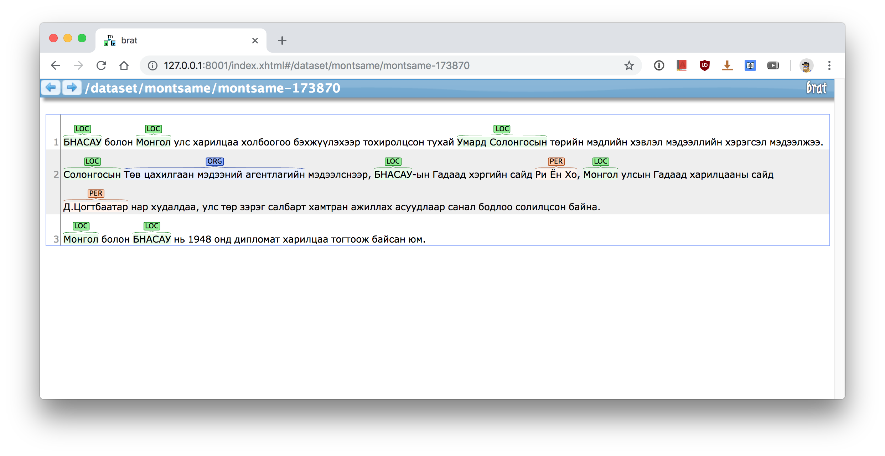

## Mongolian Named Entity Recognition

Papers:
* [Named Entity Recognition for Mongolian Language](https://www.researchgate.net/publication/300143380_Named_Entity_Recognition_for_Mongolian_Language)
  * The corpus consists of 310 articles, about 277,000 tokens, 14,837 sentences, 4,382 personal names, 4,932 location names, and 3,366 organization names.
* [Cyrillic Mongolian Named Entity Recognition with Rich Features](https://www.researchgate.net/publication/311317492_Cyrillic_Mongolian_Named_Entity_Recognition_with_Rich_Features)
  * 15000 sentences, 7509 PER, 10224 LOC, 5661 ORG and 1000 MISC
* [Mongolian Named Entity Recognition System with Rich Features](http://www.aclweb.org/anthology/C16-1049)
  * traditional Mongolian script
  
### Dataset
Currently, there is no publicly available dataset for Mongolian NER. So we have to annotate ourselves. Feel free to contribute.

To download and setup the annotation tool `brat` execute the following commands:
```sh
cd path/to/mongolian_nlp/NER
wget http://weaver.nlplab.org/~brat/releases/brat-v1.3_Crunchy_Frog.tar.gz
tar xvfz brat-v1.3_Crunchy_Frog.tar.gz
cd brat-v1.3_Crunchy_Frog
./install.sh # you have to enter some random username and password
rm -r data/*
ln -s ../../dataset data/dataset
```

To start the tool, you need python2.7:
```
python2.7 standalone.py
```

Now go to http://127.0.0.1:8001 and login with the credentials provided by the setup time.
After that you will be able to annotate Mongolian texts in the CoNLL-2002 style.


